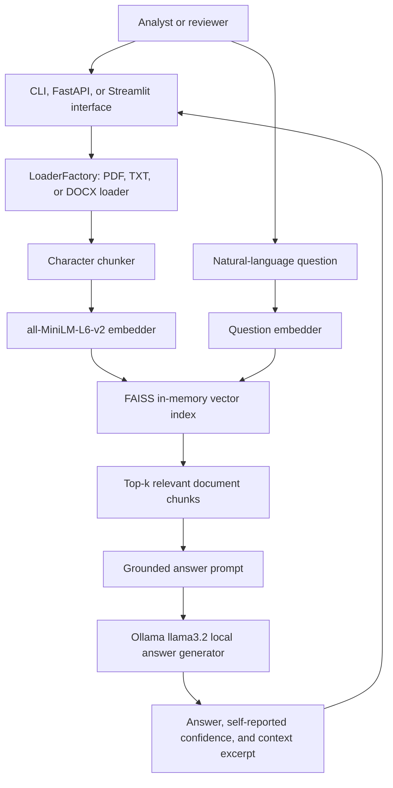

# Document Intelligence Service

An agentic Python service that summarizes business documents and answers grounded questions about them. Nimish Jain, Hexaware BPS Agentic AI Developer, 23 August 2026.

## 1. Executive Summary

Document Intelligence Service helps Business Process Services (BPS) knowledge workers summarize text-heavy documents and ask natural-language questions about a document. It accepts PDF, TXT, and DOCX files through a command-line interface, FastAPI REST API, or Streamlit web UI. Abstractive summarization uses the Hugging Face `facebook/bart-large-cnn` model. The primary agentic contribution is retrieval-augmented question answering (RAG): `all-MiniLM-L6-v2` embeds document chunks, FAISS retrieves relevant context, and local Ollama `llama3.2` generates an answer constrained to that context.

The implementation provides useful local privacy and avoids per-request cloud charges, but formal quality was not measured. Informal spot-checks found generative RAG more accurate than extractive QA on entity-heavy material, while one question remained imprecise. INT8 quantization reduced measured inference time from 6.57 seconds to 5.13 seconds, but increased model load time from 5.25 seconds to 14.69 seconds in the recorded run. The automated reliability suite passed all 14 tests. These findings are single-run observations on one machine, not statistically rigorous conclusions.

## 2. Problem and Users

In BPS, analysts and reviewers manually read large volumes of text-heavy documents to extract information, understand issues, and make decisions. This work is repetitive and slow, creates decision-making bottlenecks, and does not scale smoothly as document volume increases. The project addresses that workflow by turning documents into concise summaries and by allowing a worker to ask targeted questions instead of repeatedly searching through the full source.

The intended users are general BPS knowledge workers who process documents, including analysts and reviewers. Their needs are practical: support common office document formats, reduce reading effort, answer questions in natural language, and keep sensitive source material under local control. The service exposes the same core capability through a CLI for batch or scripted work, a REST API for integration, and a Streamlit interface for interactive use.

A plain summarization script is insufficient because it only produces a condensed representation of the input. It cannot respond flexibly to a question about a person, date, decision, or other specific fact. The Q&A agent first retrieves relevant document context and then generates an answer using only that context. This agent boundary also supports a confidence signal and a visible context excerpt, allowing uncertainty to be surfaced rather than silently presenting an unsupported answer. In this project, RAG is therefore the primary agentic contribution, while summarization is the foundational document-processing feature.

## 3. Scope

**In scope**

- Ingesting PDF, TXT, and DOCX documents.
- Paragraph-aware character chunking with hard splitting for oversized paragraphs.
- Abstractive summarization with standard Hugging Face inference or optional CPU INT8 quantization.
- Retrieval-augmented Q&A with sentence-transformer embeddings, FAISS, and local Ollama generation.
- CLI, FastAPI REST, and Streamlit interfaces.
- Async batch orchestration, bounded concurrency, error isolation, retries, structured logging, and per-document timeouts.
- Automated unit tests for chunking, loader selection, vector search, and orchestration.

**Out of scope**

- Persistent vector storage or incremental indexing.
- Multi-document Q&A in one conversation.
- A formal benchmark dataset or statistically rigorous quality study.
- Calibrated confidence, retrieval-quality scoring, or model-judge evaluation.
- Direct measurement of memory footprint, throughput, token counts, or monetary cost.
- Cloud deployment and cloud-hosted LLM inference.

## 4. Architecture

1. A user uploads or selects one supported document through the CLI, REST API, or Streamlit interface. The API writes an upload to a temporary file and removes it after processing.
2. `LoaderFactory` selects `TxtLoader`, `PdfLoader`, or `DocxLoader` from the file extension. The loader returns normalized text and source metadata.
3. For Q&A, the document is split into chunks, with the generative agent using a default chunk size of 400 characters. The chunks are embedded by `all-MiniLM-L6-v2` and added to a FAISS `IndexFlatL2` in memory.
4. The user question is embedded with the same embedder. FAISS returns the four nearest chunks for generative Q&A.
5. The chunks and question are inserted into a prompt that instructs the generator to use only the supplied context and return `ANSWER` and `CONFIDENCE` fields.
6. Ollama calls the local `llama3.2` model at temperature 0.3. The parser extracts the answer and clamps the reported confidence to the range 0.0 to 1.0, defaulting to 0.5 when the format is invalid.
7. The interface displays the answer, confidence warning or success state, and a context excerpt. Documents remain on the local machine during model execution.

Summarization follows the same ingestion boundary but uses the summarization strategy selected by configuration. The standard strategy applies `facebook/bart-large-cnn` to chunks and joins partial summaries; the optional quantized strategy applies dynamic INT8 quantization on CPU before inference. The asynchronous orchestrator limits document concurrency, serializes model inference with a lock, and skips failed or timed-out documents.

## 5. Agent Design

| Name | Role | Tools it may call | When it hands off | How it terminates |
|---|---|---|---|---|
| `DocumentQAAgent` | Extractive retrieval-based question answering | `LoaderFactory`, `Embedder`, FAISS `VectorStore`, Hugging Face `distilbert-base-cased-distilled-squad` pipeline | It does not hand off; it returns an extracted span after retrieval | Returns answer, score, and context excerpt, or raises if no document is indexed |
| `GenerativeQAAgent` | Grounded conversational question answering | `LoaderFactory`, `Embedder`, FAISS `VectorStore`, local Ollama `llama3.2` through `OllamaLLM` | It does not hand off; it returns after one grounded generation | Parses `ANSWER` and `CONFIDENCE`, clamps confidence, and returns answer plus context |
| `HybridQAAgent` | Experimental router between extractive and generative QA | `DocumentQAAgent` and `GenerativeQAAgent` | Calls both agents, discounts generative confidence by 0.75, and selects the higher value | Returns the selected mode, answer, adjusted confidence, and context |

The primary design is the generative RAG agent. Retrieval narrows the model's working context and the prompt explicitly forbids using knowledge outside the retrieved text. The extractive agent was retained as a concrete comparison and fallback design, but spot-checks showed it could be confidently wrong on entity-heavy documents. The hybrid router was also rejected as the production choice: it doubles inference work and depends on confidence signals that are not calibrated. The current Streamlit application therefore loads the generative agent directly.

The confidence value is deliberately visible but modestly interpreted. Extractive confidence comes from the QA pipeline; generative confidence is self-reported by the local model and is discounted in the hybrid implementation. Neither is a validated probability. The agent terminates after one question-answer cycle, has no persistent memory, and indexes one document at a time. This keeps the behavior understandable and local, while leaving multi-document workflows and persistent knowledge stores for future work.

## 6. Data and Knowledge

The repository contains one root sample text file and four files in `docs/`: `article.txt`, `doc1.txt`, `doc2.txt`, `doc3.txt`, and `long_article.txt`. Their committed sizes total 3,940 characters; `long_article.txt` is 3,259 characters. These files are development and demonstration material, not a formal evaluation dataset. The project had no evaluation dataset: spot-checking used one real document and a few manually authored questions.

At ingestion time, TXT files are read as UTF-8, PDF pages are extracted with `pypdf`, and DOCX paragraphs are read with `python-docx`. Text is stripped and split on paragraphs, then oversized paragraphs are hard-split to respect the configured character limit. The summarization service defaults to a 1,000-character chunk size. The extractive and generative Q&A agents default to 500 and 400 characters respectively. Q&A embeddings are generated for every chunk and stored in an in-memory FAISS L2 index; the index is rebuilt whenever a document is indexed and is not persisted.

The prompt contains only operational instructions, the retrieved chunks, and the user's question. It does not contain the entire document or a prewritten domain knowledge base. Document content enters at run time through retrieval. The summarization prompt is internal to the Hugging Face pipeline rather than a hand-authored knowledge prompt. The generative prompt asks for context-only answers and a numeric confidence field. The service does not retain a cross-request knowledge memory, and Streamlit supports one indexed document at a time.

## 7. Implementation

The stack is Python 3.11 with PyTorch, Hugging Face Transformers, Sentence Transformers, FAISS CPU, Ollama, FastAPI, Uvicorn, Streamlit, `pypdf`, `python-docx`, Pydantic Settings, and `pytest`. The selected models are `facebook/bart-large-cnn` for summarization, `distilbert-base-cased-distilled-squad` for extractive QA, `all-MiniLM-L6-v2` for embeddings, and local Ollama `llama3.2` for generative QA.

The first significant decision was to use retrieval plus local generation. Extractive-only DistilBERT was rejected because it was confidently wrong on entity-heavy documents; cloud LLM APIs were rejected because of cost, internet dependency, and document privacy. The resulting local RAG design keeps source documents on the machine and supports questions that extraction alone cannot handle.

The second decision was to keep the implementation in plain Python. LangChain and LlamaIndex were rejected as unnecessary heavy abstractions for the small, explicit pipeline. Factory and Strategy patterns provide the needed loader and summarizer substitution points without adding another orchestration framework.

The third decision was to combine asynchronous orchestration with a lock and timeout. Naive threading caused MPS deadlocks, so model inference is serialized inside a thread-safe lock while document scheduling remains asynchronous. A per-document timeout prevents one stuck inference from hanging a batch. For optimization, dynamic CPU INT8 quantization was added; it initially failed on Apple Silicon with `NoQEngine`, which was fixed by selecting the QNNPACK backend. Multi-chunk summaries are joined rather than sent through a lossy second summarization pass after incomplete merged summaries were observed.

## 8. Evaluation

The project did not use a formal evaluation dataset. Development spot-checking used one real document, `long_article.txt`, and a few manually authored questions. No synthetic or systematic case-generation process was used. No measured evaluation slices exist by document type, document length, question type, or summarization mode beyond the standard-versus-quantized benchmark comparison.

Reliability was assessed by automated code checks: the repository test suite contains 14 passing tests covering chunking, loader-factory behavior, vector-store search, empty-store behavior, single-document orchestration, multi-document orchestration, and unsupported-file isolation. These tests use mocks or small fixtures and do not load the full production models. Each automated case was run once in the recorded verification run.

Summarization quality, Q&A quality, and retrieval quality were not measured with a metric. They were assessed only through informal human manual spot-checks without a scoring rubric, so no accuracy, faithfulness, relevance, ROUGE, F1, or retrieval-recall result can be claimed. One Q&A spot-check was imprecise: a question asking who addressed the meeting returned meeting attendees rather than the speaker. This demonstrates a remaining ambiguity rather than a quantified quality rate.

Latency and compression were measured by code in `benchmark.py`, which times model loading and one inference for a repeated sample paragraph and computes summary-character length divided by input-character length. Each mode was run once on a MacBook Air with Apple Silicon and macOS, with models already cached. Standard inference used the MPS GPU backend; quantized inference used CPU with QNNPACK. Q&A indexing and answer latency were also measured once: indexing 10 chunks and three answer timings, including a first cold answer. Memory, throughput, token counts, and monetary cost were not directly measured. The reported Q&A confidence remains an uncalibrated model estimate.

## 9. Results

The following are measured numbers from the supplied single-run records only. They should not be interpreted as statistically rigorous benchmarks.

| Summarization mode | Model load (s) | Inference (s) | Compression ratio |
|---|---:|---:|---:|
| Standard (FP32), MPS | 5.25 | 6.57 | 0.397 |
| Quantized (INT8), CPU/QNNPACK | 14.69 | 5.13 | 0.297 |

| Q&A measurement | Value |
|---|---:|
| Chunks indexed | 10 |
| Indexing time (s) | 0.79 |
| First/cold answer time (s) | 19.18 |
| Second answer time (s) | 5.39 |
| Third answer time (s) | 7.80 |

| Result category | Measured result |
|---|---|
| Automated reliability tests | 14 passed |
| Formal summarization quality | not measured |
| Formal Q&A quality | not measured |
| Retrieval quality | not measured |
| Memory footprint | not measured |
| Throughput | not measured |
| Token counts | not measured |
| Monetary cost per request | not measured |

The measured quantized run had 1.44 seconds lower inference time than standard inference, approximately 22% lower relative to the standard run, while its load time was 9.44 seconds higher, approximately 3 times the standard load time. The compression ratios were 0.397 and 0.297 respectively. These values describe one sample and one run per mode; they do not establish general performance or quality. Local execution means the effective per-request API charge is zero, but monetary cost was not independently measured, so it is reported above as not measured. Memory reduction is an expected property of INT8 quantization, but was not measured on the test machine.

The principal qualitative finding was that generative RAG handled entity-heavy questions more accurately than extractive QA in manual spot-checking, although at least one answer was imprecise. The principal operational finding was that quantization traded slower startup for faster measured inference. Privacy is a key deployment strength because documents and models remain local. Deployment still requires Ollama for Q&A, quantized inference is CPU-only, and performance depends on local hardware. The project was built as part of the Hexaware BPS Agentic AI Developer program and the code is released under the MIT license.